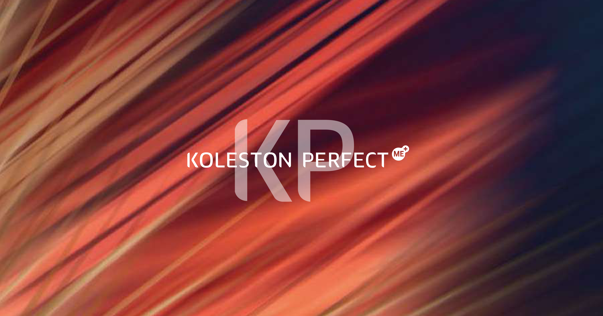

# Koleston Perfect

Полный перевод раздела **Koleston Perfect** из официального портфолио Wella Professionals «Colour Portfolio | Shade Charts» (файл `wella-koleston-perfect-shade-chart.pdf`). Текст переведён без сокращений, порядок разделов сохранён как в оригинале. Диаграммы и палитра оттенков — визуальные, поэтому приведены изображениями страниц (перерисовывать их текстом не имеет смысла, теряется точность).

## Окрашивание седых волос

Для достаточного закрашивания седины требуется добавление оттенка Pure Naturals.

- **30–50% седины** — добавить 1/3 объёма оттенка Pure Naturals.
- **50–100% седины** — добавить 1/2 объёма оттенка Pure Naturals.
- **Красные оттенки на волосах более чем с 50% седины** — добавить 1/3 оттенка Pure Naturals. Пример: 30 г красного оттенка + 15 г Pure Naturals.

### Нанесение на отросшие корни

Начинать процесс окрашивания с прикорневой зоны — в первую очередь на участках с наибольшим процентом седины. При осветлении начинать с зон, где требуется наибольшая степень осветления.

**Время выдержки — Pure Naturals / Vibrant Reds / Deep Browns:** без тепла 30–40 мин / с теплом 15–25 мин.
**Время выдержки — Special Blonde:** без тепла 50–60 мин / с теплом 25–35 мин.

**Совет!** При осветлении наносите больше продукта, чем при обычном окрашивании.

### Уходовые техники между окрашиваниями

**Pure Soft Balance.** Добавляет лёгкий оттенок и свежий блеск, поддерживая чистый результат цвета от визита к визиту. После окончания времени выдержки хорошо смочить волосы водой (для Special Blonde — 100 мл) и проэмульгировать состав по длине и кончикам.
Время выдержки: 5–10 мин.

**Pure Intense Balance, микс 1:2.** Освежает цвет для стойкого равномерного результата на выгоревших кончиках. Смешать 1 часть выбранного оттенка и 2 части 1,9% Welloxon Perfect Pastel Developer.
Время выдержки: 10–15 мин.

**Pure Rebuild Balance, микс 1:2 + Wellaplex.** Услуга с Wellaplex для обновления цвета на средней длине и кончиках с одновременным укреплением связей волоса. Нанести 1 часть выбранного оттенка и 2 части 1,9% Welloxon Perfect Pastel Developer + 1 мл Wellaplex №1 Bond Maker на каждые 30 г краски.
Время выдержки: 10–15 мин. Смыть, затем нанести Wellaplex №2 Bond Stabilizer на 10 мин.

## Схема смешивания (Mixing Guideline)

**1 часть Koleston Perfect** — для линеек Pure Naturals / Rich Naturals / Vibrant Reds / Deep Browns, соотношение **1:1** с Welloxon Perfect (пример: 60 г Koleston Perfect + 60 г Welloxon Perfect):

- **4% (13 vol)** — тот же тон или темнее; для более глубокого результата на натуральных волосах, где закрашивание седины не требуется.
- **6% (20 vol)** — тот же тон или темнее, закрашивание седины.
- **9% (30 vol)** — осветление на 2 тона.
- **12% (40 vol)** — осветление на 3 тона.

**1 часть Koleston Perfect** — для Special Blonde, соотношение **1:2** с Welloxon Perfect (пример: 60 г Koleston Perfect + 120 г Welloxon Perfect):

- **9% (30 vol)** — осветление на 3 тона.
- **12% (40 vol)** — осветление на 4–5 тонов.

### Нанесение на всю длину — тот же тон или темнее

Нанести красящую смесь сразу от корней до кончиков.
**Время выдержки — Pure Naturals / Rich Naturals / Vibrant Reds / Deep Browns:** без тепла 30–40 мин / с теплом 15–25 мин.
**Время выдержки — Special Blonde:** без тепла 50–60 мин / с теплом 25–35 мин.

### Нанесение на всю длину — с осветлением

**Первый шаг.** Нанести красящую смесь только на длину и кончики, отступив примерно 2 см от кожи головы.
Время выдержки — Pure Naturals / Rich Naturals / Deep Browns: без тепла 20 мин / с теплом 10 мин.
Время выдержки — Vibrant Reds / Special Blonde: без тепла 30 мин / с теплом 15 мин.

**Второй шаг.** Нанести красящую смесь на корни.
Время выдержки — Pure Naturals / Rich Naturals / Vibrant Reds / Deep Browns: без тепла 30–40 мин / с теплом 15–25 мин.
Время выдержки — Special Blonde: без тепла 50–60 мин / с теплом 25–35 мин.

**Совет!** Чтобы усилить насыщенность цвета на средней длине и кончиках, используйте Welloxon Perfect на одну ступень сильнее, чем на корнях.

## Глянцевание — Pure Glossing Mix 1:1:1

Быстрая услуга, чтобы добавить цвет и сияющий блеск в день окрашивания или как обновление цвета между визитами. 1 часть Koleston Perfect, 1 часть 1,9% Welloxon Perfect Pastel Developer и 1 часть INVIGO Color Service Post Color Treatment или System Professional Color Save Conditioner.
Время выдержки: 5–10 мин.

**После процедуры.** По окончании времени выдержки проэмульгировать состав небольшим количеством тёплой воды и тщательно смыть. Слегка вымыть волосы шампунем INVIGO Color Brilliance, ColorMotion+ или System Professional Color Save Shampoo C1. Чтобы нейтрализовать остатки окислителя и стабилизировать цвет, использовать INVIGO Post Color Treatment, ColorMotion+ Post Treatment или System Professional Color Lock Emulsion X4C.

## Special Mix — концентраты для усиления цвета

Возможности применения и усиления интенсивности оттенков. Тона Koleston Perfect Special Mix — это чистый цвет. Чем светлее база, тем меньше концентрата нужно. Исключение — уровень 12/.

**Таблица расчёта: глубина тона — количество Special Mix на 30 г краски:**

| Глубина тона | Special Mix на 30 г |
|---|---|
| 12/ | 0,5 г |
| 10/ | 1,0 г |
| 9/ | 1,5 г |
| 8/ | 1,5 г |
| 7/ | 2,0 г |
| 6/ | 2,5 г |
| 5/ | 3,0 г |
| 4/ | 3,5 г |
| 3/ | 4,0 г |
| 2/ | 4,5 г |

**Как усилитель в составе краски.** Пример: 30 г Koleston Perfect + 2,5 г Special Mix + 32,5 г Welloxon Perfect.

**Как самостоятельный тонер.** Special Mix можно использовать чистым с Welloxon Perfect — для яркого, насыщенного результата наносить на предварительно осветлённые волосы. Соотношение 1:1 для всех оттенков Special Mix, кроме 0/43 (например, 30 г Special Mix + 30 г Welloxon Perfect); для оттенка 0/43 — 1:2 (например, 30 г Special Mix + 60 г Welloxon Perfect).

## Пастельное тонирование — Pastel Toning Mix 1:2

Создаёт красивый пастельный блонд, корректирует нежелательные подтоны. Необходимы равномерно предварительно осветлённые или натуральные волосы (база на 1/2 тона светлее желаемого финального результата). Рекомендуется использовать оттенки линий 10/0 и 9/0. Всегда смешивается 1:2 с 1,9% Welloxon Perfect Pastel Developer.
Время выдержки: без тепла 5–10 мин.

**Важно!** Для равномерного результата цвета прочёсывайте волосы каждые 5 минут в течение времени выдержки, пока не будет достигнут желаемый оттенок.

## Система нумерации оттенков

Код оттенка состоит из двух частей: **глубина тона** (depth) и **тон/нюанс** (tone).

- **Глубина тона** — обозначает, насколько тёмный или светлый оттенок: от 2/ (самый тёмный) до 10/ (самый светлый).
- **Тон** — обозначает тональный характер оттенка: от /0 (натуральный) до /9.

Чем светлее база, тем ярче проявляется тон; чем темнее база, тем более сдержанным становится тон.

## Аллерготест — обязателен за 48 часов

Хотя риск возникновения новой аллергии снижен, всегда остаётся риск аллергической реакции, которая может быть тяжёлой. Аллерготест обязательно проводить за 48 часов до любой процедуры окрашивания.

**Шаг 1.** Смешать 5 г выбранного на консультации оттенка с 5 г окислителя.
**Шаг 2.** Нанести состав на участок 1 см² прямо под сгибом локтя.
**Шаг 3.** Оставить открытым на 45 минут, затем смыть тёплой водой и промокнуть чистым полотенцем.
**Шаг 4.** Попросить клиента вернуться в салон через 48 часов или позвонить и сообщить результат.

Попросите клиента не трогать тестовый участок 48 часов. При покраснении, жжении или зуде красящий состав наносить нельзя — клиенту нужно проконсультироваться с врачом перед следующим окрашиванием. Если у клиента уже случалась аллергическая реакция на красители для волос, окрашивание проводить нельзя.

Рекомендуется проводить аллерготест за 48 часов до окрашивания.

## Цветовое уравнение и дополнительные цвета

**Дополнительный цвет (Complementary Colour).** Противоположные цвета нейтрализуют друг друга — «истинное цветовое уравнение»: холодный + холодный + тёплый = холодный результат, тёплый + тёплый + холодный = тёплый результат.

**Кривая осветления (Lightening Curve).** Показывает, какие фоновые пигменты проявляются в процессе окрашивания по мере осветления волос.

**Цветовое уравнение (Colour Equation).** При выборе оптимального решения для клиента на консультации нужно учитывать три составляющих: тон кожи, цвет глаз и цвет волос. Научно-исследовательская группа Wella Professionals с помощью технологии отслеживания взгляда (eye tracking) доказала: самый привлекательный результат достигается, когда одна из трёх составляющих выделяется и контрастирует с двумя другими. Формула мгновенного эффекта — «цветовое уравнение». Используйте персонализированную палитру оттенков на консультации с клиентом, чтобы подобрать и показать наиболее выигрышный результат с учётом цветового уравнения.

## Полная палитра оттенков Koleston Perfect

Палитра включает линейки **Pure Naturals**, **Rich Naturals**, **Special Blonde** (с подгруппами Natural/Warm/Cool, Resistant/Cover, Cool/Cover/Ultra/Pure), **Deep Browns**, **Vibrant Reds** и **Special Mix/Clear** — коды оттенков от 12/0 до 0/00, полный перечень тонов приведён на изображении выше (оригинальная печатная таблица, перерисовка текстом исказила бы коды).

---

**Изображения в этой папке** (`images/`): `cover.png` — обрезанная обложка раздела Koleston Perfect (без верхней шапки WELLA/MAIN MENU, использована как cover.png статьи на сайте); `page-01.png`…`page-06.png` — полные развороты раздела Koleston Perfect в исходном порядке (печатные страницы 4, 5, 6, 7, 8, 10 оригинального PDF). Рендер в высоком разрешении (3x).

**Статус:** этот черновик перенесён на сайт — итоговая статья в `src/content/articles/2026-08-13-koleston-perfect.md`, картинки для сайта (сжатые, переименованные) — в `public/images/articles/2026-08-13-koleston-perfect/`. Эта папка оставлена как архив исходных материалов и текста черновика.
